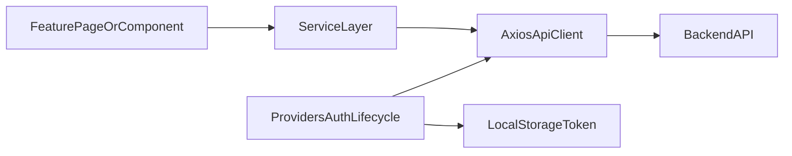

# Chapters Frontend Architecture

## Overview

`chapters-frontend` is a Next.js 14 App Router application with feature-grouped routes and a client-side service layer that integrates:

- Blog backend APIs
- Portfolio backend APIs
- Keycloak browser authentication
- External image upload API for media assets

The app is primarily client-rendered in feature pages (`"use client"`), with provider-driven auth/session behavior.

## Source Layout

- `app/layout.jsx`: root layout and global composition entry
- `app/page.jsx`: landing route (`/`)
- `app/(blog)/*`: blog route group
- `app/(portfolio)/*`: portfolio route group
- `app/(auth)/*`: auth route group
- `app/components/*`: shared and feature components
- `app/providers/*`: context providers and global UI/auth state
- `app/lib/services/*`: API clients and service methods
- `app/data/*`: local/static fallback datasets

## Routing Model

This repo uses App Router route groups to separate feature domains:

- Blog
  - `/blog`
  - `/blog/[id]`
  - `/blog/new`
  - `/blog/edit/[id]`
- Portfolio
  - `/portfolio`
  - `/portfolio/add-item`
  - `/portfolio/edit-item/[id]`
- Auth
  - `/auth/signup`

Feature-level layout wrappers live in:
- `app/(blog)/layout.jsx`
- `app/(portfolio)/layout.jsx`
- `app/(auth)/layout.jsx`

## Provider Composition

Root provider wiring is centralized in `app/providers/Providers.jsx`.

Primary provider responsibilities:

- Auth lifecycle
  - Initialize Keycloak (`check-sso`)
  - Handle token refresh and logout behavior
  - Write/remove token values from `localStorage`
  - Set/remove Axios authorization defaults for primary API clients
- Navigation state
  - Context for dynamic navbar action behavior (for example write/publish actions)
- UI system
  - Chakra provider wraps application UI

## Data and Request Flow

Typical flow:
1. Feature page/component triggers a service call (often in `useEffect` or on submit).
2. Service method maps UI payload to backend contract.
3. Axios client sends request using env-driven base URL and headers.
4. Provider-managed auth lifecycle supplies token header defaults.
5. Response is mapped to UI-specific shape.

## Auth Architecture

- Keycloak client setup: `app/lib/services/keycloak.js`
- Provider lifecycle and token propagation: `app/providers/Providers.jsx`
- UI auth-dependent controls: `app/components/common/Navbar.jsx`

Current auth behavior:
- Access/refresh tokens are persisted in browser storage.
- Bearer token defaults are set on Axios clients after auth initialization/refresh.
- Some feature routes redirect unauthenticated users from protected create flows.

## Service Boundaries

- `app/lib/services/blogApi.js`: blog API Axios instance
- `app/lib/services/blogService.js`: blog-specific operations and mappings
- `app/lib/services/portfolioApi.js`: portfolio API Axios instance
- `app/lib/services/portfolioService.js`: portfolio-specific operations and mappings

Design intent:
- Keep base URL and transport config in API wrapper files.
- Keep payload/response mapping and domain logic in service files.

## Known Architectural Risks

- Browser-visible env namespace (`NEXT_PUBLIC_*`) currently includes values that should be treated as sensitive.
- Some service methods still use hardcoded identity/URL assumptions.
- Mixed static-data and API-driven portfolio behavior increases inconsistency risk.
- Limited automated test coverage raises regression risk in auth/data flows.

See:
- `docs/API_AND_CONTRACTS.md`
- `docs/DATA_MODELS_AND_STORAGE.md`
- `docs/RISK_REGISTER.md`
